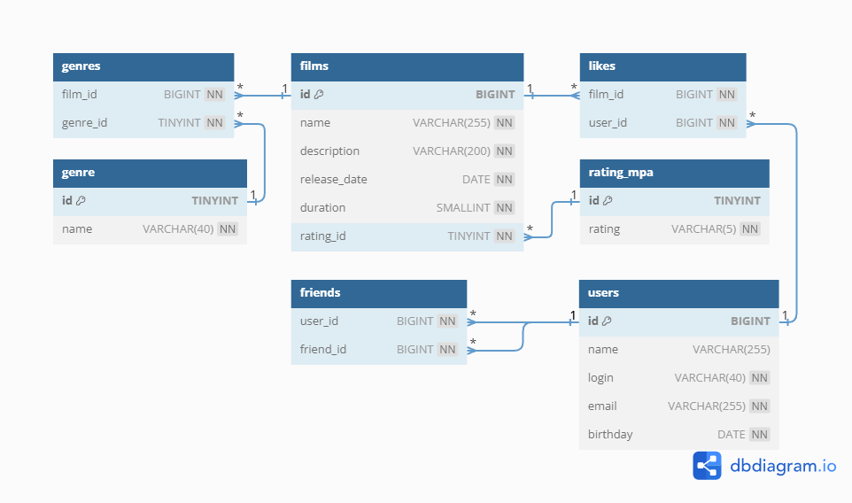

# java-filmorate
## Схема базы данных



### Примеры запросов

- для получения списка всех фильмов:
  ```sql
  SELECT f.*, r.rating 
  FROM films AS f 
  JOIN rating_mpa AS r ON r.id = f.rating_id;
  ```
- для получения списка всех пользователей:
  ```sql
  SELECT *
  FROM users;
  ```
- список 10 наиболее популярных фильмов:
  ```sql
  SELECT f.*, r.rating
  FROM films AS f
  JOIN rating_mpa AS r ON r.id = f.rating_id
  JOIN likes AS l ON l.film_id = f.id
  GROUP BY l.film_id
  ORDER BY COUNT(l.user_id) DESC
  LIMIT 10;
  ```
- список общих друзей `@user_1` и `@user_2`
  ```sql
  SELECT *
  FROM users
  WHERE id IN (SELECT f1.friend_id
               FROM friends AS f1
               JOIN friends AS f2 ON f1.friend_id = f2.friend_id
               JOIN friend_request AS fr ON fr.id = f1.friend_request_id
               WHERE f1.user_id = @user_1 AND f2.user_id = @user_2
  );
  ```